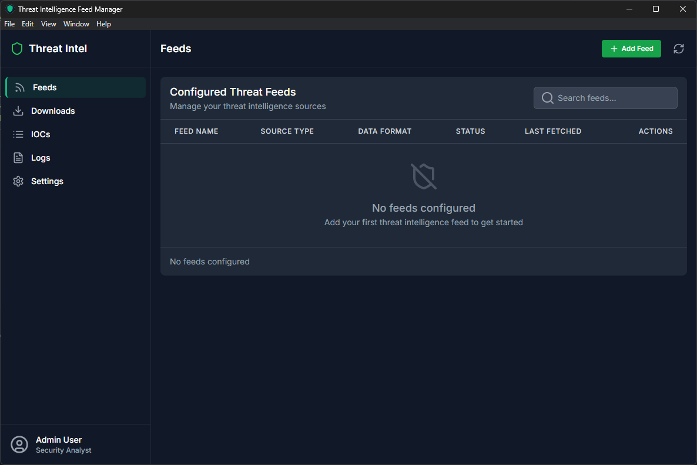
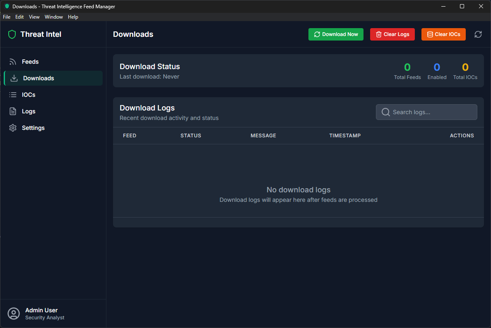
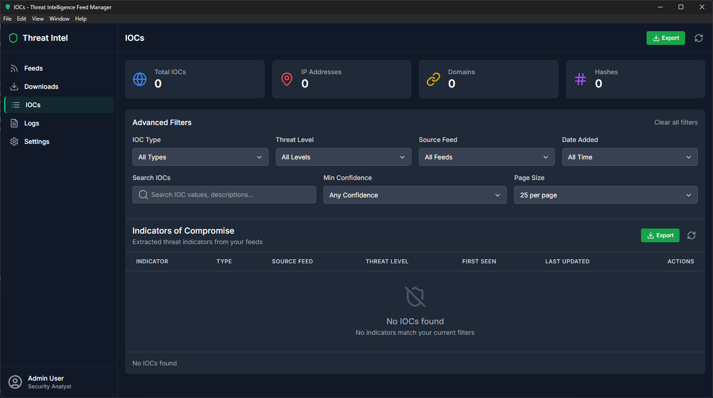
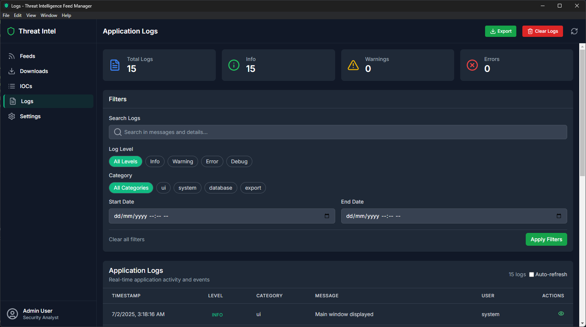
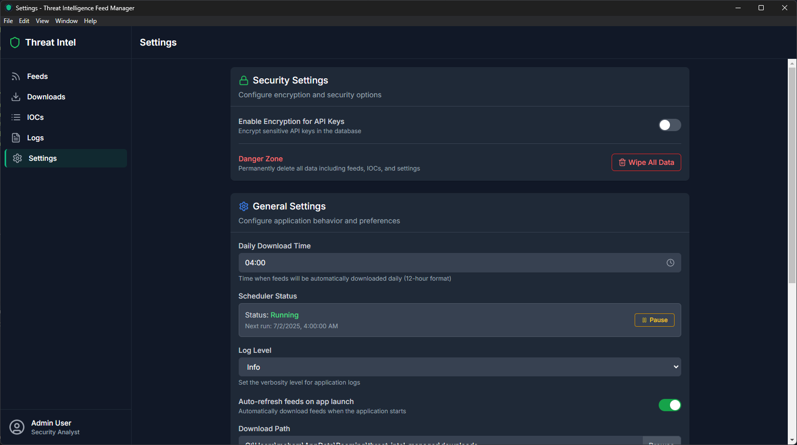

# Threat Intelligence Feed Manager

A powerful desktop application that helps security professionals automatically collect, organize, and manage threat intelligence data from multiple sources. Think of it as a smart assistant that continuously monitors the internet for potential security threats and keeps everything organized for you.

## What is Threat Intelligence?

Threat intelligence is information about potential security threats that could harm your organization. This includes things like:
- **Malicious IP addresses** that might attack your systems
- **Suspicious websites** that could steal information
- **Harmful file signatures** that indicate malware
- **Phishing email addresses** that try to trick users

## Why This Application is Useful

In today's digital world, security threats are constantly evolving. Security teams need to:
- **Stay updated** with the latest threat information
- **Organize large amounts** of security data efficiently
- **Automate repetitive tasks** like downloading threat feeds
- **Quickly search and filter** through thousands of threat indicators
- **Keep sensitive information secure** with encryption

This application solves all these challenges by providing a centralized, automated system for threat intelligence management.

## Key Features

### 🔄 **Automated Data Collection**
- Automatically downloads threat intelligence from multiple sources
- Runs on a schedule you set (default: daily at 4:00 AM)
- Handles different data formats (JSON, CSV, XML, text)
- Retries failed downloads automatically

### 🛡️ **Security & Privacy**
- Encrypts sensitive API keys to keep them safe
- Optional master password protection
- All data stored locally on your computer
- No data sent to external servers

### 📊 **Smart Organization**
- Automatically categorizes threats by type (IPs, domains, URLs, etc.)
- Advanced filtering and search capabilities
- Tagging system for custom organization
- Threat level scoring and analysis

### 📈 **Comprehensive Monitoring**
- Detailed logs of all activities
- Download status tracking
- Error reporting and troubleshooting
- Export capabilities for reporting

### 🎨 **User-Friendly Interface**
- Modern, dark-themed interface
- Intuitive navigation
- Real-time statistics and updates
- Responsive design that works on different screen sizes

## Application Pages

### 🏠 **Feeds Page** - Managing Your Data Sources

The Feeds page is your command center for managing where the application gets its threat intelligence data from.

#### What You Can Do Here:

**View All Your Data Sources**
- See a complete list of all threat intelligence feeds you've configured
- Each feed shows its name, type, format, status, and when it was last updated
- Color-coded status indicators show which feeds are active (green) or disabled (gray)

**Add New Data Sources**
- Click the "Add Feed" button to configure a new threat intelligence source
- Choose from popular sources like AlienVault, Abuse.ch, or VirusTotal
- Or add custom sources with your own URLs
- Set up API keys securely (stored encrypted if you enable security features)

**Manage Existing Feeds**
- Edit feed settings anytime by clicking the edit button
- Enable or disable feeds without deleting them
- Delete feeds you no longer need
- See detailed information about each feed's performance

**Supported Feed Types:**
- **AlienVault OTX**: Community-driven threat intelligence
- **Abuse.ch**: Malware and botnet tracking
- **VirusTotal**: File and URL reputation data
- **Custom**: Any threat feed with a public URL

**Data Formats Supported:**
- **JSON**: Most common format for modern APIs
- **CSV**: Spreadsheet-style data
- **XML**: Structured data format
- **Text**: Simple text-based feeds

### ⬇️ **Downloads Page** - Monitoring Data Collection

The Downloads page gives you complete visibility into how your threat intelligence data is being collected and any issues that might arise.

#### Key Features:

**Download Status Overview**
- See when the last download occurred
- View total number of feeds configured
- Count of enabled feeds actively collecting data
- Total number of threat indicators collected

**Real-Time Download Logs**
- Chronological list of all download attempts
- Color-coded status indicators:
  - 🟢 **Green**: Successful downloads
  - 🔴 **Red**: Failed downloads with error details
  - 🟡 **Yellow**: Warnings or partial failures
- Timestamps for every activity
- Detailed error messages for troubleshooting

**Manual Controls**
- **Download Now**: Manually trigger all enabled feeds to download immediately
- **Clear Logs**: Remove old download history to keep the interface clean
- **Clear IOCs**: Remove all collected threat data (useful for fresh starts)
- **Refresh**: Update the display with latest information

**Download Progress Tracking**
- When you start a manual download, a progress window appears
- Shows percentage completion
- Displays which feed is currently being processed
- Provides real-time status updates

**Troubleshooting Features**
- Click on any failed download to see detailed error information
- Retry individual failed feeds
- View network connection issues
- Check API key problems

### 🎯 **IOCs Page** - Exploring Your Threat Data

The IOCs (Indicators of Compromise) page is where you explore, search, and analyze all the threat intelligence data that has been collected from your feeds.

#### What You'll Find Here:

**Statistics Dashboard**
- **Total IOCs**: Complete count of all threat indicators
- **IP Addresses**: Number of malicious IP addresses
- **Domains**: Count of suspicious websites and domains
- **Hashes**: Number of malicious file signatures

**Advanced Search & Filtering**
- **Search Bar**: Find specific threats by typing any part of the indicator
- **Type Filter**: Filter by threat type (IPs, domains, URLs, hashes, emails)
- **Threat Level Filter**: Show only high, medium, or low-risk threats
- **Source Feed Filter**: View threats from specific data sources
- **Date Range Filter**: Focus on recent or historical threats

**Comprehensive Threat Table**
Each threat indicator shows:
- **Value**: The actual threat (IP address, domain, etc.)
- **Type**: What kind of threat it is
- **Source**: Which feed provided this information
- **Threat Level**: Risk assessment (High/Medium/Low)
- **Tags**: Categories and labels
- **Date Added**: When this threat was first discovered
- **Confidence**: How reliable this threat information is

**Threat Analysis Features**
- **Automatic Scoring**: Each threat gets a risk score based on multiple factors
- **Feed Reputation**: Threats from more reliable sources get higher scores
- **Recency Analysis**: Newer threats are scored higher than old ones
- **Tag Analysis**: Threats with specific tags (like "malware" or "ransomware") get higher scores

**Export Capabilities**
- Export all threat data to CSV format
- Filter data before exporting
- Include all threat details and metadata
- Perfect for reports or sharing with other security tools

**Interactive Features**
- Click on any threat to see detailed information
- Sort table by any column
- Bulk operations on selected threats
- Quick actions for common tasks

### 📋 **Logs Page** - System Activity Monitoring

The Logs page provides detailed insights into everything happening within the application, helping you understand system performance and troubleshoot any issues.

#### Log Categories:

**Statistics Overview**
- **Total Logs**: Complete count of all system activities
- **Info Logs**: Normal operations and successful activities
- **Warning Logs**: Potential issues that need attention
- **Error Logs**: Problems that need immediate attention

**Comprehensive Filtering**
- **Search**: Find specific log entries by typing keywords
- **Log Level Filter**: Show only errors, warnings, info, or debug messages
- **Category Filter**: Focus on specific areas (database, downloads, security, etc.)
- **Date Range**: View logs from specific time periods
- **User Filter**: See activities from different user sessions

**Detailed Log Information**
Each log entry shows:
- **Timestamp**: Exact time the event occurred
- **Level**: Importance of the message (Error, Warning, Info, Debug)
- **Category**: What part of the system generated the log
- **Message**: Human-readable description of what happened
- **Details**: Technical information for troubleshooting
- **User**: Which user or system process triggered the event

**Log Categories Include:**
- **System**: Application startup, shutdown, and core operations
- **Database**: Database connections, queries, and data operations
- **Download**: Feed download attempts, successes, and failures
- **Security**: Encryption, authentication, and security events
- **UI**: User interface interactions and page loads
- **Export**: Data export operations and file operations

**Export and Management**
- **Export Logs**: Download all logs as a CSV file for external analysis
- **Clear Logs**: Remove old log entries to free up space
- **Auto-Cleanup**: System automatically removes old logs to prevent database bloat

**Troubleshooting Features**
- **Error Details**: Click on error logs to see technical details
- **Stack Traces**: For developers, see the exact code path that caused issues
- **Context Information**: Each log includes relevant system information
- **Session Tracking**: Follow user sessions to understand workflow issues

### ⚙️ **Settings Page** - Application Configuration

The Settings page allows you to customize how the application works, manage security features, and configure automated behaviors.

#### Security Settings:

**Encryption Options**
- **Enable Encryption**: Toggle to encrypt sensitive API keys in the database
- **Master Password**: Set a password to protect encrypted data
- **Password Visibility**: Show/hide password when typing
- **Encryption Status**: See whether encryption is currently active

**Data Protection**
- **API Key Security**: When enabled, all API keys are encrypted using your master password
- **Session Management**: Encryption keys are only stored in memory during active use
- **Secure Storage**: All sensitive data is stored locally with industry-standard encryption

**Danger Zone**
- **Wipe All Data**: Permanently delete all feeds, IOCs, logs, and settings
- **Confirmation Required**: Multiple confirmations prevent accidental data loss
- **Complete Reset**: Returns the application to a fresh installation state

#### General Settings:

**Download Schedule**
- **Daily Download Time**: Choose when automated downloads should run (default: 4:00 AM)
- **Time Picker**: Easy-to-use interface for selecting hours and AM/PM
- **24-Hour Format**: Option to use 24-hour time format
- **Time Zone**: Uses your system's local time zone

**Application Behavior**
- **Download Interval**: How often feeds should be checked (default: 60 minutes)
- **Auto-Refresh**: Automatically refresh data when the application starts
- **Log Level**: Choose how detailed the logging should be:
  - **Verbose**: All activities logged (for debugging)
  - **Info**: Normal operations and important events
  - **Warning**: Only warnings and errors
  - **Error**: Only error messages

**Data Management**
- **Log Retention**: How long to keep log entries (default: 10,000 entries)
- **Database Location**: Where data files are stored (usually automatic)
- **Backup Options**: Manual backup and restore capabilities

**User Interface**
- **Theme**: Dark mode (currently the only theme available)
- **Language**: Interface language (currently English only)
- **Notifications**: System notification preferences
- **Accessibility**: High contrast and screen reader support

## Getting Started

### Installation

1. **Download the Application**
   - Download the latest version for your operating system
   - Windows: `.exe` installer
   - macOS: `.dmg` file
   - Linux: `.AppImage` file

2. **Install and Launch**
   - Run the installer and follow the setup wizard
   - Launch the application from your start menu or applications folder
   - The application will create its data folder automatically

3. **First-Time Setup**
   - The application will guide you through initial configuration
   - Set up your master password if you want to use encryption
   - Add your first threat intelligence feed

### Adding Your First Feed

1. **Navigate to the Feeds Page**
   - Click on "Feeds" in the sidebar
   - Click the "Add Feed" button

2. **Configure the Feed**
   - **Name**: Give your feed a descriptive name (e.g., "AlienVault OTX")
   - **Source Type**: Choose from the dropdown (AlienVault, Abuse.ch, etc.)
   - **Feed URL**: Enter the URL where the threat data is located
   - **API Key**: If required, enter your API key (will be encrypted)
   - **Data Format**: Select the format of the data (JSON, CSV, etc.)
   - **Enable Feed**: Check this to start collecting data immediately

3. **Save and Test**
   - Click "Add Feed" to save your configuration
   - The feed will appear in your feeds list
   - You can manually test the feed by going to the Downloads page

### Understanding Your Data

**Threat Types Explained:**
- **IP Addresses**: Malicious servers or computers on the internet
- **Domains**: Suspicious websites that might host malware or phishing pages
- **URLs**: Specific web pages that are known to be dangerous
- **Hashes**: Digital fingerprints of malicious files
- **Emails**: Phishing email addresses or malicious sender addresses

**Threat Levels:**
- **High**: Immediate threat that requires attention
- **Medium**: Potential threat that should be monitored
- **Low**: Suspicious activity that might be worth investigating

**Confidence Scores:**
- **90-100**: Very reliable threat information
- **70-89**: Reliable information from trusted sources
- **50-69**: Moderate confidence, may need verification
- **Below 50**: Low confidence, should be investigated further

## Troubleshooting

### Common Issues

**Feeds Not Downloading**
- Check your internet connection
- Verify the feed URL is correct
- Ensure API keys are valid (if required)
- Check the Downloads page for specific error messages

**Application Won't Start**
- Ensure you have the latest version
- Check that your system meets minimum requirements
- Try running the database diagnostic tool
- Reinstall the application if problems persist

**Slow Performance**
- Clear old logs from the Logs page
- Reduce the number of enabled feeds
- Increase the download interval in settings
- Check available disk space

**Encryption Issues**
- Make sure you remember your master password
- Try disabling and re-enabling encryption
- Contact support if you can't recover encrypted data

### Getting Help

**Built-in Diagnostics**
- Use the database diagnostic tool for technical issues
- Check the Logs page for detailed error information
- Export logs for technical support

**System Requirements**
- **Operating System**: Windows 10+, macOS 10.14+, or Linux
- **Memory**: 4GB RAM minimum, 8GB recommended
- **Storage**: 1GB free space for application and data
- **Network**: Internet connection for downloading threat feeds

## Security and Privacy

### Data Protection
- All data is stored locally on your computer
- No information is sent to external servers
- API keys are encrypted when security features are enabled
- Database files are protected by your operating system's security

### Encryption Features
- **AES Encryption**: Industry-standard encryption for sensitive data
- **Salt Generation**: Additional security for password protection
- **Session Management**: Encryption keys are cleared when the application closes
- **Secure Storage**: Encrypted data is stored in your system's secure location

### Best Practices
- Use a strong master password if enabling encryption
- Keep your API keys secure and don't share them
- Regularly update the application for security patches
- Back up your data regularly
- Use the application on a secure, trusted computer

## Advanced Features

### Automation
- **Scheduled Downloads**: Set up automatic daily downloads
- **Retry Logic**: Failed downloads are automatically retried
- **Progress Tracking**: Monitor download progress in real-time
- **Error Handling**: Comprehensive error reporting and recovery

### Data Analysis
- **Threat Scoring**: Automatic risk assessment of all threats
- **Feed Reputation**: Weighting based on source reliability
- **Recency Analysis**: Newer threats get higher priority
- **Pattern Recognition**: Identify trends in threat data

### Integration Capabilities
- **CSV Export**: Export data for use in other security tools
- **API Support**: Connect to external threat intelligence platforms
- **Custom Feeds**: Add any threat feed with a public URL
- **Data Formats**: Support for JSON, CSV, XML, and text formats

## Support and Updates

### Keeping Updated
- The application checks for updates automatically
- Download the latest version from the official website
- Updates include new features, security patches, and bug fixes

### Community Support
- Check the documentation for common questions
- Use the built-in diagnostic tools for troubleshooting
- Export logs for technical support requests

### Feature Requests
- The application is actively developed
- New features are added based on user feedback
- Security improvements are prioritized

---

**Note**: This application is designed for security professionals and organizations that need to manage threat intelligence data. Always follow your organization's security policies and procedures when using threat intelligence tools.

---

## Copyright Notice

**All rights reserved.**

This repository is for viewing purposes only. No copying, distribution, modification, or commercial use is permitted without explicit written permission from the author. 